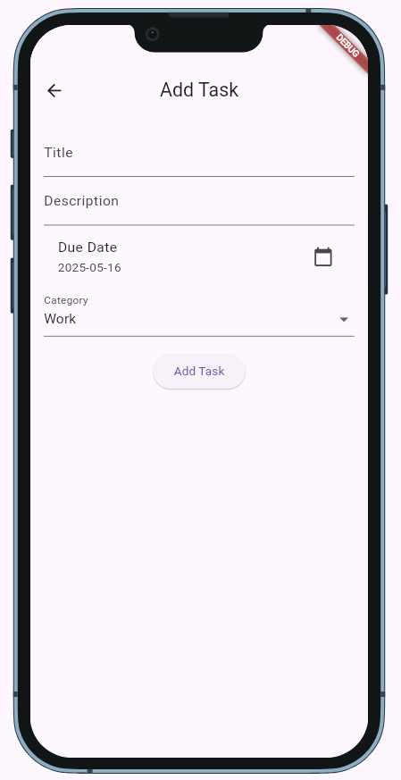
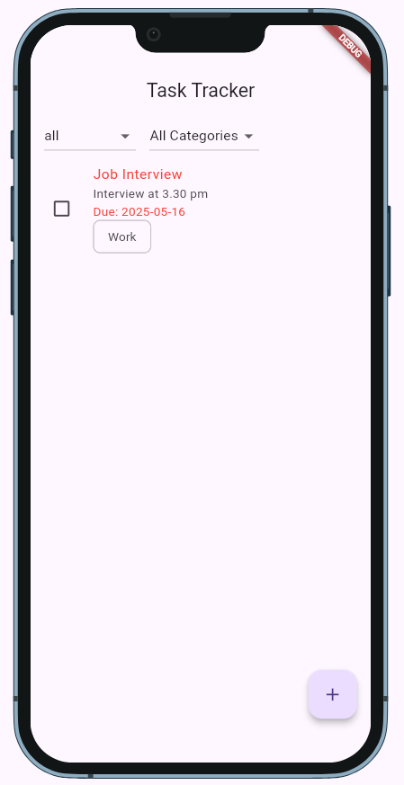
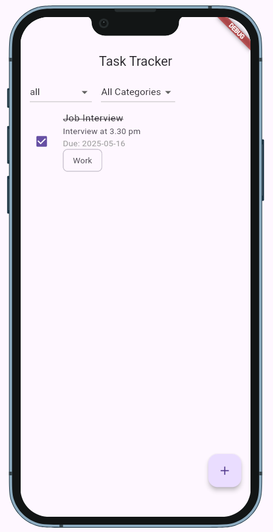

# Task Tracker Mobile App

A mobile application built with Flutter framework and Dart programming language for tracking tasks and managing to-dos.

## Prerequisites

Before you begin, ensure you have the following installed:
- [Flutter](https://flutter.dev/docs/get-started/install) (latest version)
- [Dart](https://dart.dev/get-dart) (latest version)
- [Android Studio](https://developer.android.com/studio) or [VS Code](https://code.visualstudio.com/) with Flutter extensions
- Android Emulator or iOS Simulator (for testing)

## Installation

After setting up flutter into your machine navigate into the lib folder and clone the repository into the lib folder.

1. Clone the repository:
```bash
git clone https://github.com/yourusername/Task_Tracker_Mobile_App.git

2. Install Dependencies 

```bash
flutter pub get
```

3. Configure Device

- Start an Android Emulator or connect a physical device
- Check connected devices:
```bash
flutter devices
```
4. Run the Application

For debug mode:
```bash
flutter run 
```

## App Preview

1 . The add task page



2.  Home page after a task is added



3. Display showing a task is complete

